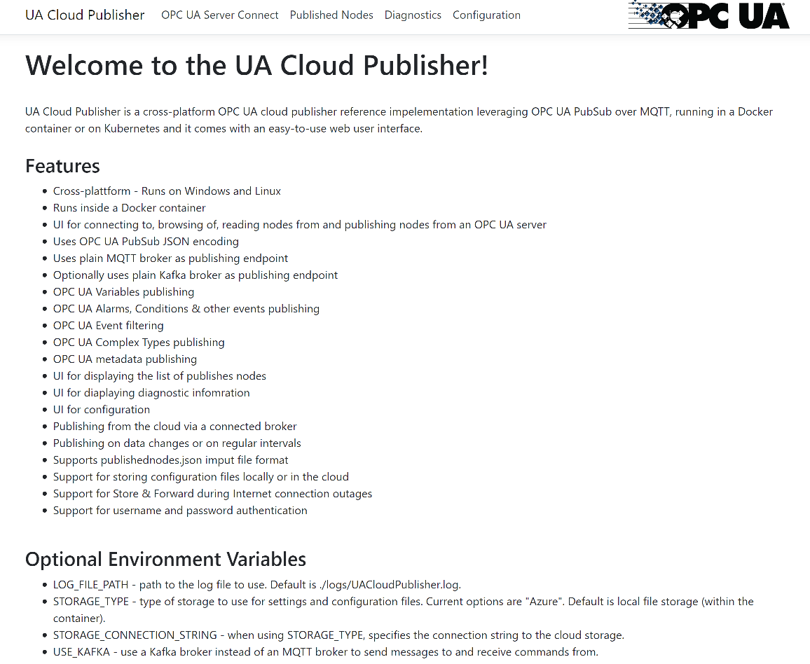
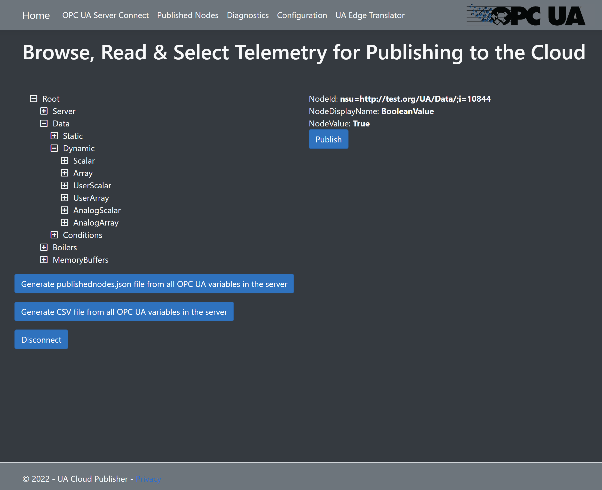
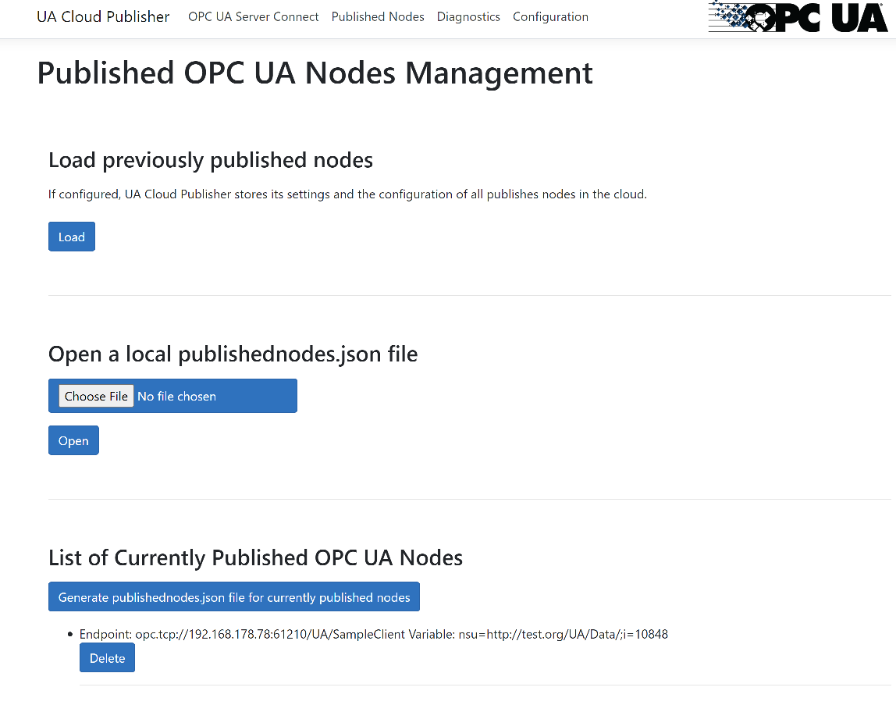
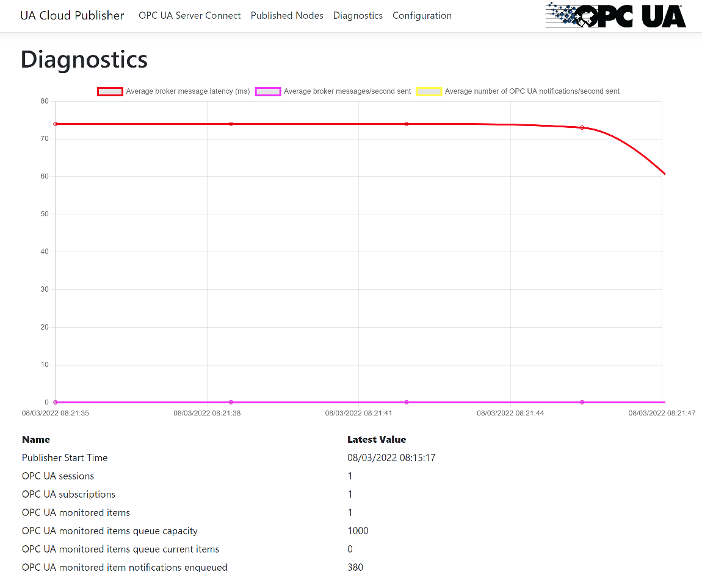
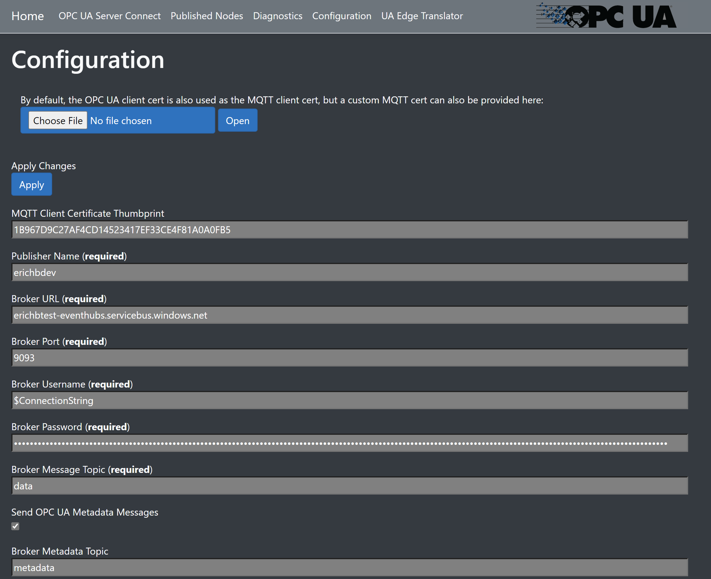
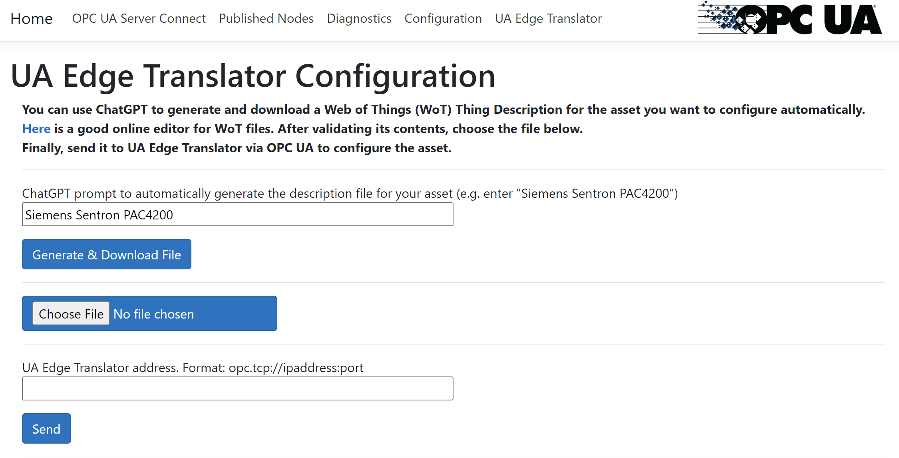

# UA Cloud Publisher

A cross-platform OPC UA cloud publisher reference implementation leveraging OPC UA PubSub over MQTT. It runs in a Docker container on standard Docker hosts or on Kubernetes and comes with an easy-to-use web user interface.

## Features

* Cross-plattform - Runs on Windows and Linux
* Runs inside a Docker container and on Kubernetes
* UI for connecting to, browsing of, reading nodes from and publishing nodes from an OPC UA server
* Uses OPC UA PubSub JSON encoding
* Uses plain MQTT broker as publishing endpoint
* Optionally uses plain Kafka broker as publishing endpoint
* OPC UA Variables publishing
* OPC UA Alarms, Conditions & other events publishing
* OPC UA Event filtering
* OPC UA Complex Types publishing
* OPC UA metadata publishing
* UI for displaying the list of publishes nodes
* UI for displaying diagnostic information
* UI for configuration
* Publishing from the cloud via a broker
* Publishing on data changes or on regular intervals
* Supports publishednodes.json imput file format
* Support for storing configuration files locally or in the cloud
* Support for Store & Forward during Internet connection outages
* Support for username and password authentication
* Support for both Intel x64 and ARM x64 architectures (Raspberry Pi4, etc.) with pre-built Docker containers ready for use
* Integration with [UA Edge Translator](https://github.com/barnstee/UA-EdgeTranslator)

## Screenshots

### Main Page:


### Browser:


### Published Nodes Management:


### Diagnostics:


### Configuration:


### UA Edge Translator Integration:


## Usage

Docker containers are automatically built and published. Simply run the UA Cloud Publisher on a Docker-enabled computer via:

`docker run -itd -p 80:80 ghcr.io/barnstee/ua-cloudpublisher:main`

And then point your browser to <http://yourIPAddress>.

### Persisting Settings

UA Cloud Publisher settings and published nodes configuration can be persisted in the Cloud across Docker container restarts by running:

`docker run -itd -e STORAGE_TYPE="Azure" -e STORAGE_CONNECTION_STRING="yourCloudStorageConnectionString" -p 80:80 ghcr.io/barnstee/ua-cloudpublisher:main`

UA Cloud Publisher settings and published nodes configuration can be persisted locally across Docker container restarts by running:

`docker run -itd -v c:/publisher/logs:/app/logs -v c:/publisher/settings:/app/settings -p 80:80 ghcr.io/barnstee/ua-cloudpublisher:main`

For Linux hosts, remove the "c:" instances from the command above.

And then point your browser to <http://yourIPAddress>.

## Optional Environment Variables

* LOG_FILE_PATH - path to the log file to use. Default is /app/logs/UACloudPublisher.log (in the Docker container).
* STORAGE_TYPE - type of storage to use for settings and configuration files. Current options are "Azure". Default is local file storage (under /app/settings/ in the Docker container).
* STORAGE_CONNECTION_STRING - when using STORAGE_TYPE="Azure", specifies the connection string to the cloud storage.
* STORAGE_CONTAINER_NAME - when using STORAGE_TYPE="Azure", specifies the blob storage container name.
* USE_KAFKA - if present, use a Kafka broker instead of an MQTT broker to send messages to and receive commands from.

## PublishedNodes.json File Format

(All intervals must be specified in milliseconds)

```json
[
 {
  "EndpointUrl": "string", // e.g. "opc.tcp://opcua.example.com/"
  "OpcNodes": [
   {
    "Id": "string", // Expanded Node Id
    "OpcSamplingInterval": 1000,
    "OpcPublishingInterval": 1000,
    "HeartbeatInterval": 0,  // set to a value > 0 if you want to publish static values on regular intervals
    "SkipFirst": false
   }
  ],
  "OpcEvents": [
   {
    "ExpandedNodeId": "string", // e.g. "nsu=http://example.com/Instance/;i=56643"
    "Filter": [
     {
      "OfType": "string" // Expanded node ID of event type to filter by e.g. "nsu=http://opcfoundation.org/UA/MachineTool/;i=39"
     }
    ]
   }
  ],
  "OpcAuthenticationMode": "Anonymous", // or "UsernamePassword"
  "UserName": "string",
  "Password": "string"
 }
]
```

## Sub-topics for Configuration from the Cloud

### PublishNodes

Payload:
(All intervals must be specified in milliseconds)

```json
{
 "Command": "publishnodes",
 "CorrelationId": "D892A987-56FB-4724-AF14-5EC6A7EBDD07", // a GUID
 "TimeStamp": "2022-11-28T12:01:00.0923534Z", // sender timestamp in UTC
 "EndpointUrl": "string",
 "OpcNodes": [
  {
   "Id": "string", // Expanded Node Id
   "OpcSamplingInterval": 1000,
   "OpcPublishingInterval": 1000,
   "HeartbeatInterval": 0,
   "SkipFirst": false
  }
 ],
 "OpcEvents": [
  {
   "ExpandedNodeId": "string",
   "Filter": [
    {
     "OfType": "string" // Expanded node ID of event type to filter by
    }
   ]
  }
 ],
 "OpcAuthenticationMode": "Anonymous", // or "UsernamePassword"
 "UserName": "string",
 "Password": "string"
}
```

Response:

```json
{
 [
  "string"
 ]
}
```

### UnpublishNodes

Payload:

```json
{
 "Command": "unpublishnodes",
 "CorrelationId": "D892A987-56FB-4724-AF14-5EC6A7EBDD07", // a GUID
 "TimeStamp": "2022-11-28T12:01:00.0923534Z", // sender timestamp in UTC
 "EndpointUrl": "string",
 "OpcNodes": [
  {
   "Id": "string" // Expanded Node Id
  }
 ],
 "OpcEvents": [
  {
   "ExpandedNodeId": "string"
  }
 ]
}
```

Response:

```json
{
 [
  "string"
 ]
}
```

### UnpublishAllNodes

Payload:

```json
{
 "Command": "unpublishallnodes",
 "CorrelationId": "D892A987-56FB-4724-AF14-5EC6A7EBDD07", // a GUID
 "TimeStamp": "2022-11-28T12:01:00.0923534Z", // sender timestamp in UTC
}
```

Response:

```json
{
 [
  "string"
 ]
}
```

### GetPublishedNodes

Payload:

```json
{
 "Command": "getpublishednodes",
 "CorrelationId": "D892A987-56FB-4724-AF14-5EC6A7EBDD07", // a GUID
 "TimeStamp": "2022-11-28T12:01:00.0923534Z", // sender timestamp in UTC
}
```

Response:
(All intervals are in milliseconds)

```json
[
 {
  "EndpointUrl": "string",
  "OpcNodes": [
   {
    "Id": "string", // Expanded Node Id
    "OpcSamplingInterval": 1000,
    "OpcPublishingInterval": 1000,
    "HeartbeatInterval": 0,
    "SkipFirst": false
   }
  ],
  "OpcEvents": [
   {
    "ExpandedNodeId": "string",
    "Filter": [
     {
      "OfType": "string"
     }
    ]
   }
  ],
  "OpcAuthenticationMode": "string"
 }
]
```

### GetInfo

Payload:

```json
{
 "Command": "getinfo",
 "CorrelationId": "D892A987-56FB-4724-AF14-5EC6A7EBDD07", // a GUID
 "TimeStamp": "2022-11-28T12:01:00.0923534Z", // sender timestamp in UTC
}
```

Response:

```json
{
 "DiagnosticInfos": [
  {
   "PublisherStartTime": "2022-02-22T22:22:22.222Z",
   "ConnectedToBroker": false,
   "NumberOfOpcSessionsConnected": 0,
   "NumberOfOpcSubscriptionsConnected": 0,
   "NumberOfOpcMonitoredItemsMonitored": 0,
   "MonitoredItemsQueueCount": 0,
   "EnqueueCount": 0,
   "EnqueueFailureCount": 0,
   "NumberOfEvents": 0,
   "MissedSendIntervalCount": 0,
   "TooLargeCount": 0,
   "SentBytes": 0,
   "SentMessages": 0,
   "SentLastTime": "2022-02-22T22:22:22.222Z",
   "FailedMessages": 0,
   "AverageMessageLatency": 0,
   "AverageNotificationsInBrokerMessage": 0
  }
 ]
}
```

## Build Status

[](https://github.com/barnstee/UA-CloudPublisher/actions/workflows/docker-publish.yml)
