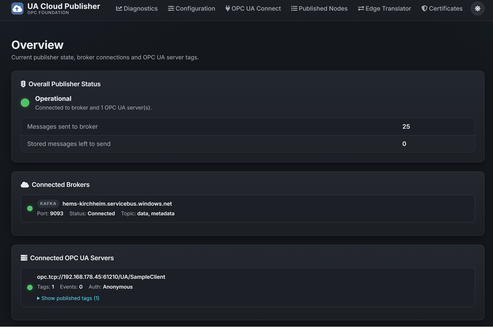
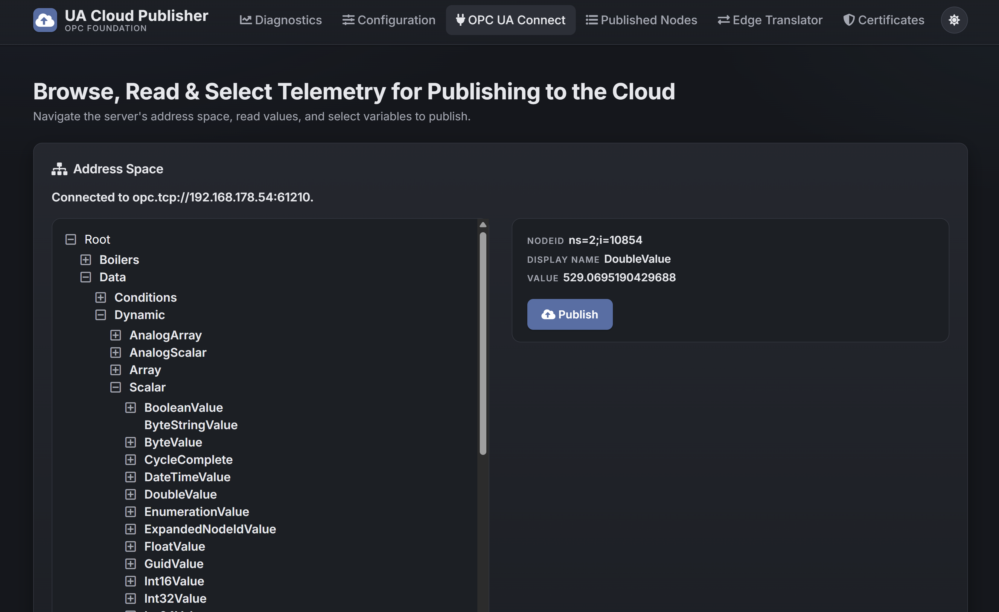
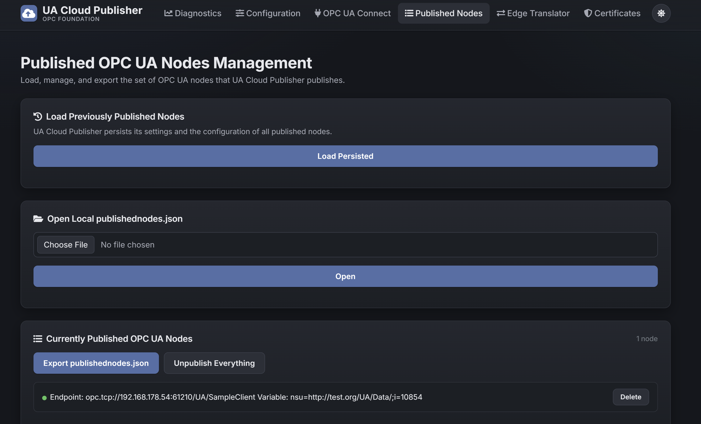
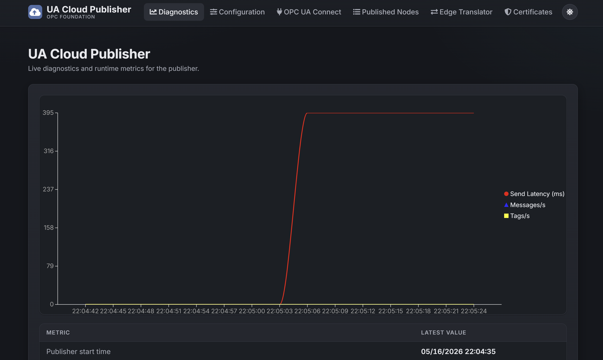
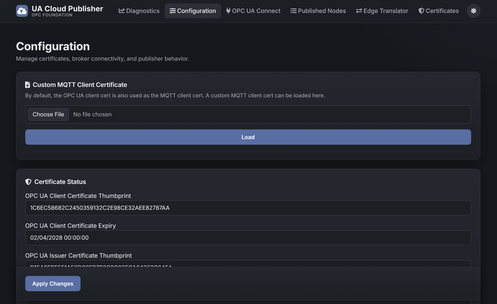
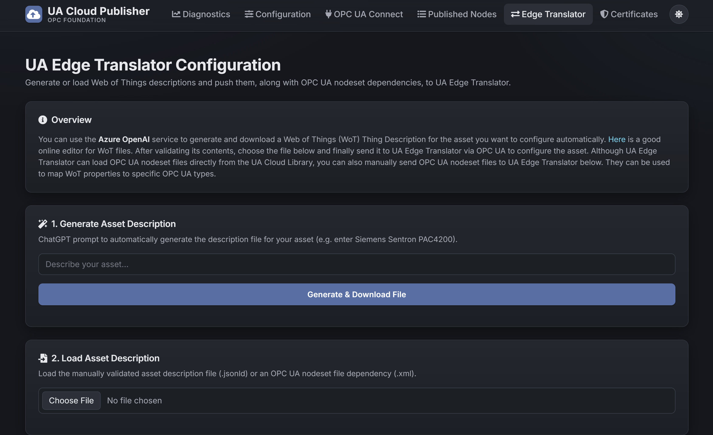

# UA Cloud Publisher

A cross-platform OPC UA cloud publisher reference implementation leveraging OPC UA PubSub over MQTT and Kafka. It runs in a container image on standard Docker hosts or on Kubernetes and comes with an easy-to-use web user interface.

## Build Status

[](https://github.com/barnstee/UA-CloudPublisher/actions/workflows/docker-publish.yml)

## Table of Contents

- [Features](#features)
- [Screenshots](#screenshots)
  - [Overview](#overview)
  - [Browser](#browser)
  - [Published Nodes Management](#published-nodes-management)
  - [Diagnostics](#diagnostics)
  - [Configuration](#configuration)
  - [UA Edge Translator Integration](#ua-edge-translator-integration)
- [Usage](#usage)
  - [Running on Docker](#running-on-docker)
    - [Persisting Logs, Settings, Published Nodes and OPC UA Certificates](#persisting-logs-settings-published-nodes-and-opc-ua-certificates)
  - [Running on Kubernetes](#running-on-kubernetes)
- [Using the Alternative Broker](#using-the-alternative-broker)
- [CloudEvents Metadata Messages](#cloudevents-metadata-messages)
- [Optional Environment Variables](#optional-environment-variables)
- [PublishedNodes.json File Format](#publishednodesjson-file-format)
- [Sub-topics for Configuration from the Cloud](#sub-topics-for-configuration-from-the-cloud)
  - [PublishNodes](#publishnodes)
  - [UnpublishNodes](#unpublishnodes)
  - [UnpublishAllNodes](#unpublishallnodes)
  - [GetPublishedNodes](#getpublishednodes)
  - [GetInfo](#getinfo)

## Features

- Cross-plattform - Runs natively on Windows and Linux
- Runs inside a Docker container and on Kubernetes
- UI for connecting to, browsing of, reading nodes from and publishing nodes from an OPC UA server
- Generates a CSV file containing all OPC UA nodes from a connected server
- Generates a `publishednodes.json` file containing all OPC UA variable nodes from a connected server
- Uses OPC UA PubSub JSON encoding
- Uses MQTT broker as publishing endpoint
- Uses Kafka broker as publishing endpoint
- Support for multiple Kafka brokers for publishing (one for UA data, one more UA metadata)
- Support for websockets transport with MQTT broker
- Support for username/password authentication for Kafka broker
- Support for username/password authentication for MQTT broker
- Support for certificate authentication for MQTT broker
- Support for sending OPC UA metadata to an alternative broker
- Support for reverse connects from OPC UA servers
- Support for subscriptions transfer when server connections are temporarily interrupted
- Support for auto-publishing of all WoT properties found in a WoT file sent to UA Edge Translator
- OPC UA Variables publishing
- OPC UA Alarms, Conditions & other events publishing
- OPC UA Event filtering
- OPC UA Complex Types publishing
- OPC UA metadata messages publishing
- Support for encoding OPC UA metadata messages as CloudEvents (an alternative to the PubSub NetworkMessage header)
- OPC UA status messages publishing
- Diagnostics info publishing
- UI for displaying the list of publishes nodes
- UI for displaying diagnostic information
- UI for configuration
- Light and dark themed UI
- Publishing from the cloud via a broker
- Publishing on data changes or on regular intervals
- Supports `publishednodes.json` input file format
- Support for storing configuration files locally
- Support for Store & Forward during internet connection outages
- Support for username and password authentication
- Support for Intel/AMD `x64` and `arm64` architectures (Raspberry Pi4, etc.) with pre-built container images ready for use
- Integration with [UA Edge Translator](https://github.com/barnstee/UA-EdgeTranslator)
- Support for generating the Web of Things (WoT) Thing Descriptions (TDs) for UA Edge Translator automatically using ChatGPT
- Support for configuring UA Edge Translator via WoT TDs
- Support for uploading OPC UA Information Models to UA Edge Translator
- Support for issuing a new X509 certificate and trust list to connected OPC UA servers (GDS Server Push functionality)

## Screenshots

### Overview



### Browser



### Published Nodes Management



### Diagnostics



### Configuration



### UA Edge Translator Integration



## Usage

UA Cloud Publisher is distributed as a pre-built, multi-architecture (`x64` and `arm64`) container image published to GitHub Container Registry. It can be run on any Docker host or on a Kubernetes cluster.

Note: We have also provided a [test environment](./TestEnvironment/readme.md) to get you started.

### Running on Docker

Docker containers are automatically built and published. Simply run the UA Cloud Publisher on a Docker-enabled computer via:

`docker run -itd -p 80:8080 ghcr.io/barnstee/ua-cloudpublisher:main`

And then point your browser to <http://yourIPAddress>.

#### Persisting Logs, Settings, Published Nodes and OPC UA Certificates

UA Cloud Publisher logs, settings, published nodes and OPC UA certificates can be persisted locally across Docker container restarts by running:

`docker run -itd -v c:/publisher/logs:/app/logs -v c:/publisher/settings:/app/settings -v c:/publisher/pki:/app/pki -p 80:8080 ghcr.io/barnstee/ua-cloudpublisher:main`

For Linux hosts, remove the `c:` instances from the command above.

And then point your browser to `http://yourIPAddress`.

### Running on Kubernetes

A ready-to-use Kubernetes deployment manifest is provided in [`UA-CloudPublisher.yaml`](./UA-CloudPublisher.yaml). Applying it creates:

- a dedicated `ua-cloudpublisher-namespace` namespace,
- a single-replica `Deployment` running the `ghcr.io/barnstee/ua-cloudpublisher:main` image on a Linux node, and
- a `LoadBalancer` `Service` that exposes the web UI on port `8080`.

Deploy it with:

`kubectl apply -f UA-CloudPublisher.yaml`

Once the service has been assigned an external IP (check with `kubectl get service ua-cloudpublisher -n ua-cloudpublisher-namespace`), point your browser to `http://<externalIP>:8080`.

Before deploying, review and adjust the following in the manifest to match your environment:

- **OPC UA credentials**: the `OPCUA_USERNAME` and `OPCUA_PASSWORD` environment variables (used when connecting to OPC UA servers and for GDS Server Push). See [Optional Environment Variables](#optional-environment-variables) for the full list of variables you can add here.
- **Persistent storage**: the `settings`, `pki` and `logs` volumes persist configuration, OPC UA certificates and logs across pod restarts. The sample uses `hostPath` volumes pointing at `/mnt/c/K3s/PublisherConfig/...` (a K3s-on-Windows layout); change these paths — or replace them with `PersistentVolumeClaim`s — to suit your cluster.

## Using the Alternative Broker

UA Cloud Publisher contains a second broker client that can be used to send OPC UA PubSub metadata to a second broker (via MQTT or Kafka).

## CloudEvents Metadata Messages

By default, OPC UA metadata messages (`ua-metadata`) are published with the standard OPC UA PubSub JSON NetworkMessage header. Alternatively, you can enable the **Use CloudEvents header for metadata messages** option on the configuration page to publish metadata messages as [CloudEvents](https://cloudevents.io/) instead, following the [CloudEvents OPC UA extension](https://github.com/cloudevents/spec/blob/main/cloudevents/extensions/opcua.md).

When enabled, metadata messages use the CloudEvents binary content mode: the message payload contains only the OPC UA `DataSetMetaData`, and the header information is mapped to CloudEvents context attributes that are carried as transport headers (MQTT user properties, or Kafka `ce_`-prefixed headers):

| CloudEvents attribute | Value                            |
| --------------------- | -------------------------------- |
| `specversion`         | `1.0`                            |
| `type`                | `ua-metadata`                    |
| `id`                  | the message ID                   |
| `source`              | the configured Publisher ID      |
| `subject`             | the DataSetWriterId              |
| `time`                | the message timestamp (RFC 3339) |
| `datacontenttype`     | `application/json`               |

## Optional Environment Variables

- AZURE_OPENAI_API_ENDPOINT - the endpoint URL of the Azure OpenAI instance to use in the form https://[yourinstancename].openai.azure.com/
- AZURE_OPENAI_API_KEY - the key to use
- AZURE_OPENAI_API_DEPLOYMENT_NAME - the deployment to use
- OPCUA_USERNAME - OPC UA server username to use (for GDS push and when none is specified in publishednodes.json file)
- OPCUA_PASSWORD - OPC UA server password to use (for GDS push and when none is specified in publishednodes.json file)

## PublishedNodes.json File Format

(All intervals must be specified in milliseconds)

```json
[
  {
    "EndpointUrl": "string", // e.g. "opc.tcp://opcua.example.com/"
    "OpcNodes": [
      {
        "Id": "string", // Expanded Node Id
        "OpcSamplingInterval": 1000,
        "OpcPublishingInterval": 1000,
        "HeartbeatInterval": 0, // set to a value > 0 if you want to publish static values on regular intervals
        "SkipFirst": false
      }
    ],
    "OpcEvents": [
      {
        "ExpandedNodeId": "string", // e.g. "nsu=http://example.com/Instance/;i=56643"
        "Filter": [
          {
            "OfType": "string" // Expanded node ID of event type to filter by e.g. "nsu=http://opcfoundation.org/UA/MachineTool/;i=39"
          }
        ]
      }
    ],
    "OpcAuthenticationMode": "Anonymous", // or "UsernamePassword"
    "UserName": "string",
    "Password": "string"
  }
]
```

## Sub-topics for Configuration from the Cloud

### PublishNodes

Payload:
(All intervals must be specified in milliseconds)

```json
{
  "Command": "publishnodes",
  "CorrelationId": "D892A987-56FB-4724-AF14-5EC6A7EBDD07", // a GUID
  "TimeStamp": "2022-11-28T12:01:00.0923534Z", // sender timestamp in UTC
  "EndpointUrl": "string",
  "OpcNodes": [
    {
      "Id": "string", // Expanded Node Id
      "OpcSamplingInterval": 1000,
      "OpcPublishingInterval": 1000,
      "HeartbeatInterval": 0,
      "SkipFirst": false
    }
  ],
  "OpcEvents": [
    {
      "ExpandedNodeId": "string",
      "Filter": [
        {
          "OfType": "string" // Expanded node ID of event type to filter by
        }
      ]
    }
  ],
  "OpcAuthenticationMode": "Anonymous", // or "UsernamePassword"
  "UserName": "string",
  "Password": "string"
}
```

Response:

```json
{
 [
  "string"
 ]
}
```

### UnpublishNodes

Payload:

```json
{
  "Command": "unpublishnodes",
  "CorrelationId": "D892A987-56FB-4724-AF14-5EC6A7EBDD07", // a GUID
  "TimeStamp": "2022-11-28T12:01:00.0923534Z", // sender timestamp in UTC
  "EndpointUrl": "string",
  "OpcNodes": [
    {
      "Id": "string" // Expanded Node Id
    }
  ],
  "OpcEvents": [
    {
      "ExpandedNodeId": "string"
    }
  ]
}
```

Response:

```json
{
 [
  "string"
 ]
}
```

### UnpublishAllNodes

Payload:

```json
{
  "Command": "unpublishallnodes",
  "CorrelationId": "D892A987-56FB-4724-AF14-5EC6A7EBDD07", // a GUID
  "TimeStamp": "2022-11-28T12:01:00.0923534Z" // sender timestamp in UTC
}
```

Response:

```json
{
 [
  "string"
 ]
}
```

### GetPublishedNodes

Payload:

```json
{
  "Command": "getpublishednodes",
  "CorrelationId": "D892A987-56FB-4724-AF14-5EC6A7EBDD07", // a GUID
  "TimeStamp": "2022-11-28T12:01:00.0923534Z" // sender timestamp in UTC
}
```

Response:
(All intervals are in milliseconds)

```json
[
  {
    "EndpointUrl": "string",
    "OpcNodes": [
      {
        "Id": "string", // Expanded Node Id
        "OpcSamplingInterval": 1000,
        "OpcPublishingInterval": 1000,
        "HeartbeatInterval": 0,
        "SkipFirst": false
      }
    ],
    "OpcEvents": [
      {
        "ExpandedNodeId": "string",
        "Filter": [
          {
            "OfType": "string"
          }
        ]
      }
    ],
    "OpcAuthenticationMode": "string"
  }
]
```

### GetInfo

Payload:

```json
{
  "Command": "getinfo",
  "CorrelationId": "D892A987-56FB-4724-AF14-5EC6A7EBDD07", // a GUID
  "TimeStamp": "2022-11-28T12:01:00.0923534Z" // sender timestamp in UTC
}
```

Response:

```json
{
  "DiagnosticInfos": [
    {
      "PublisherStartTime": "2022-02-22T22:22:22.222Z",
      "ConnectedToBroker": false,
      "NumberOfOpcSessionsConnected": 0,
      "NumberOfOpcSubscriptionsConnected": 0,
      "NumberOfOpcMonitoredItemsMonitored": 0,
      "MonitoredItemsQueueCount": 0,
      "EnqueueCount": 0,
      "EnqueueFailureCount": 0,
      "NumberOfEvents": 0,
      "MissedSendIntervalCount": 0,
      "TooLargeCount": 0,
      "SentBytes": 0,
      "SentMessages": 0,
      "SentLastTime": "2022-02-22T22:22:22.222Z",
      "FailedMessages": 0,
      "AverageMessageLatency": 0,
      "AverageNotificationsInBrokerMessage": 0
    }
  ]
}
```
